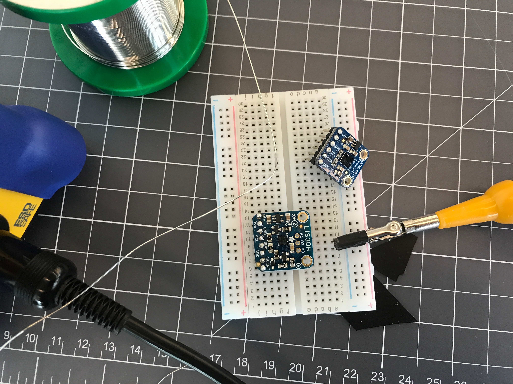

# Lab prep 3 
## by Natalie B. Abrams

### PRE-SOLDERING:

 
STATE DIAGRAMS: To sketch out how your interactive devices should act in different modes, we will be using state diagrams. Please review this tutorial on Everything to Know about State Diagrams

(optional) I2C: In the upcoming lab, the accelerometer and proximity sensor share the same communication bus! Here is a quick example of how that works. http://www.mbeddedc.com/2017/05/i2c-bus-communication-protocol-tutorial.html

READING: This is intended to help you understand what it means to prototype and test interactions: Bill Moggridge, Designing Interactions, Chapter 10

IDEA GENERATION: The point of this week's lab is to figure out a cool interaction that you can make possible with the a micro controller which can record data generated by a sensor, and then play it back. You could make programmable piano. You could make that records how much you toss and turn at night. You could make something that measures the changing light levels in your room.

Draw sketches with each of your ideas.
